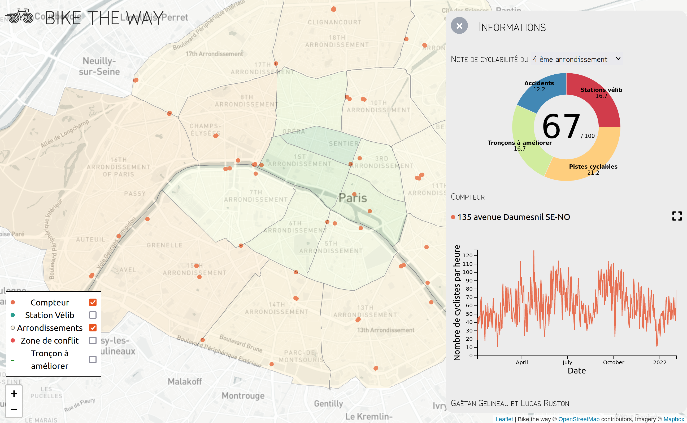

# Data visualization about bicycles in Paris

A preview of this project is available [here](https://bike-the-way.netlify.app/).



## Context

This project has been developped by two students of the engineering school Centrale Lyon interested in sustainable
development and soft mobility (Lucas Ruston and Gaëtan Gelineau). It has been developed during the Centrale Lyon's data
visualization course.

The cycling policy of recent years has been greatly improved and the health context has greatly influenced transport.
Therefore, the goal of this project is to observe the evolution of the bicycles, cycling infrastructures and remaining
problems in Paris. This project use multiple data sources : Open Data from Paris city, data from the "Baromètre cyclable
des villes", data from the Vélib station, ect... In order to see an exhaustive list of all data used, refer to the sources
section.

## Project architecture

The project have been made with Vue 3, Leaflet and the D3 library. D3 graphics can be seen in the `src/graph` folder,
the Map component (located in `src/Graph.vue`) contains all the data plotting on the map and the map itself.

The `ruston_gelineau_rendu_data_visualisation (1).pdf` contain paper models of the project for the data visualization
course in Centrale Lyon.

## Project setup

```
npm install
```

### Compiles and hot-reloads for development

```
export NODE_OPTIONS=--openssl-legacy-provider
npm run serve
```

### Compiles and minifies for production

```
npm run build
```

### Lints and fixes files

```
npm run lint
```

## Sources used for this project

- The counter location dataset from Paris Open Data website : [here](https://opendata.paris.fr/explore/dataset/comptage-velo-compteurs/information/?disjunctive.id_compteur&disjunctive.nom_compteur&disjunctive.id&disjunctive.name&disjunctive.counter&basemap=jawg.dark&location=12,48.85861,2.33755&dataChart=eyJxdWVyaWVzIjpbeyJjaGFydHMiOlt7InR5cGUiOiJjb2x1bW4iLCJmdW5jIjoiQ09VTlQiLCJ5QXhpcyI6ImludGVydmFsIiwic2NpZW50aWZpY0Rpc3BsYXkiOnRydWUsImNvbG9yIjoiIzY2NjZmZiJ9XSwieEF4aXMiOiJpbnN0YWxsYXRpb25fZGF0ZSIsIm1heHBvaW50cyI6bnVsbCwidGltZXNjYWxlIjoieWVhciIsInNvcnQiOiIiLCJjb25maWciOnsiZGF0YXNldCI6ImNvbXB0YWdlLXZlbG8tY29tcHRldXJzIiwib3B0aW9ucyI6eyJkaXNqdW5jdGl2ZS5pZF9jb21wdGV1ciI6dHJ1ZSwiZGlzanVuY3RpdmUubm9tX2NvbXB0ZXVyIjp0cnVlLCJkaXNqdW5jdGl2ZS5pZCI6dHJ1ZSwiZGlzanVuY3RpdmUubmFtZSI6dHJ1ZSwiZGlzanVuY3RpdmUuY291bnRlciI6dHJ1ZX19fV0sImRpc3BsYXlMZWdlbmQiOnRydWUsImFsaWduTW9udGgiOnRydWV9)
- The counter dataset from Paris Open Data website : [here](https://opendata.paris.fr/explore/dataset/comptage-velo-donnees-compteurs/information/?disjunctive.id_compteur&disjunctive.nom_compteur&disjunctive.id&disjunctive.name)
- The dataset from the FUB about the opinion provided by cyclists : [here](https://opendata.parlons-velo.fr/)
- The vélib location dataset : [here](https://opendata.paris.fr/explore/dataset/velib-emplacement-des-stations/information/)
- Length of bicycle lanes from Paris Open Data website [here](https://opendata.paris.fr/explore/dataset/reseau-cyclable/)
- Accidents involving bicycles [here](https://www.data.gouv.fr/fr/datasets/bases-de-donnees-annuelles-des-accidents-corporels-de-la-circulation-routiere-annees-de-2005-a-2020/)

## Data formatting

The datasets used in this projet are located in the **public/data** folder, along with some scripts used to parse and format them. To avoid loading all the data at once in the website (which would result in really slow loading time), this web app is loading each dataset separately when needed (for instance when clicking on a specific counter, the graph data for that counter is loaded)

As explained above, most of this data was obtained from open data websites, and we used a scraping script (**public/data/scrapper.js**) to fetch all the counters datasets and format them.

Some formatting and filtering was also done in the script **public/data/computeStatistics.js** and we computed the districts score with **public/data/districtScores.js**

The use of d3 geoContains method, combined with geojson datasets,s allowed us to dynamically determine in which district of Paris a given point is located. We used this to compute data for each district's cycling score.
